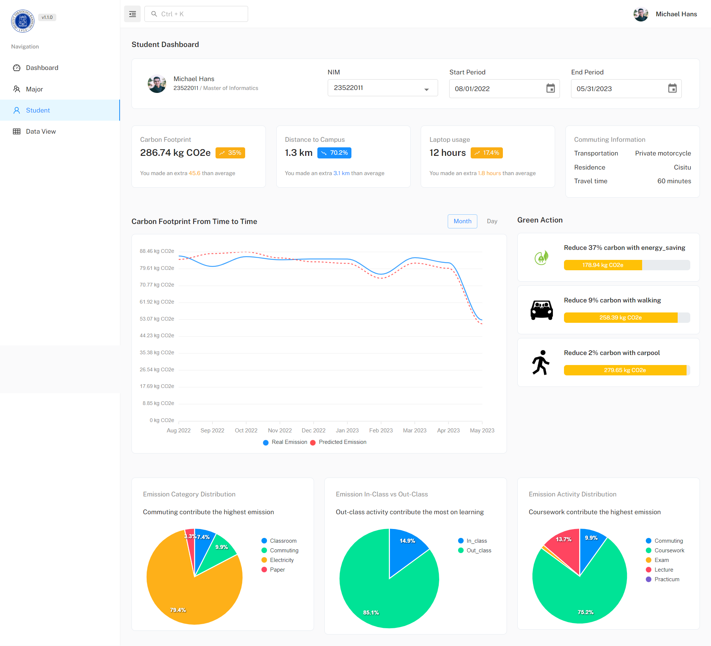

# Student Carbon Footprint Tools Dashboard

Student Carbon Footprint Tools is a powerful dashboard application that provides valuable insights and information related to carbon emissions resulting from student learning activities. With the Student Carbon Footprint Tools Dashboard, students and stakeholders can gain valuable insights into carbon emissions and make data-driven decisions to reduce their environmental impact and promote sustainability.



## Features
1. ITB Dashboard
2. Major Dashboard
3. Student Dashboard
4. Data View

### Dashboard Contents
Each dashboard includes the following information:

* **Carbon Footprint Calculation Results**: View the carbon emissions generated by student activities based on the provided data.

* **Carbon Footprint Prediction in the Future**: Get predictions on future carbon emissions, helping to plan and take appropriate actions.

* **Carbon Footprint Factors and Distribution**: Understand the contributing factors to carbon emissions and their distribution across different activities.

* **Green Action to Reduce Carbon Footprint**: Discover actionable steps to reduce carbon emissions and promote sustainability.

### Additional Features
For ITB and Major Dashboard, you can access additional information, such as:

* **Major Statistics**: Gain insights into the carbon emissions specific to each major within the university.

* **Courses Emission Comparison**: Compare carbon emissions generated by different courses, helping students and faculty make informed decisions.

* **Mode of Transportation** Distribution: Visualize the distribution of transportation methods used by students, contributing to carbon emissions.

### Data View
The Data View provides a detailed breakdown of carbon emissions, including:

* **Carbon Footprint History Day by Day from a Student (Tabular Views)**: Track the carbon emissions of individual students over time.

* **Carbon Footprint Major Comparison (Tabular Views)**: Compare carbon emissions across different majors in both numerical and tabular formats.

* **Carbon Footprint Students Comparison (Tabular Views)**: Compare carbon emissions among students, facilitating a better understanding of their individual contributions.

## Getting started

Clone from GitHub

```
git clone https://github.com/michaellhans/student-footprint.git
yarn
yarn start
```

## Technology stack

-   [Material UI V5](https://mui.com/core/)
-   Built with React Hooks API.
-   Redux & React context API for state management.
-   Redux toolkit.
-   React Router for navigation routing.
-   Support for react-script.
-   Code splitting.
-   CSS-in-JS.

## Author

* 23522011 / Michael Hans

